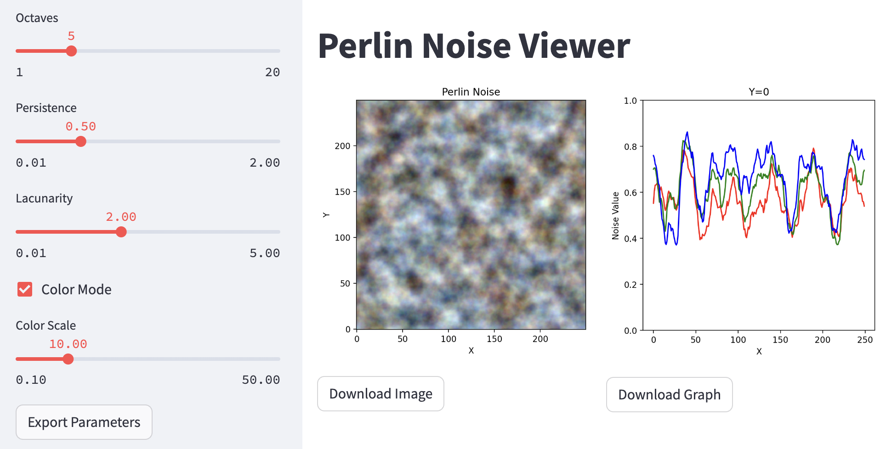

# PerlinNoiseViewer

https://perlin-noise-viewer.streamlit.app/
## Setup
```
conda create -n noise python==3.9
conda activate noise
pip install -r requirements.txt
```
## Run app
```
streamlit run app.py   
```